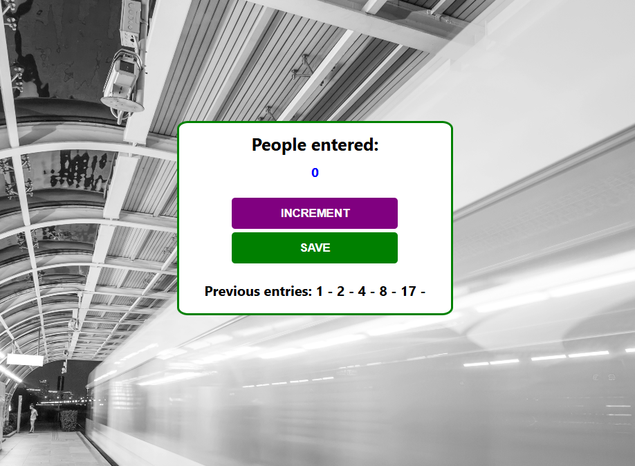

# Passenger Counter Application

This is an app to count the passengers boarding a train.


## Table of contents

- [Overview](#overview)
  - [Screenshot](#screenshot)
  - [Links](#links)
- [My process](#my-process)
  - [Built with](#built-with)
  - [Sample HTML and JS snippets](#Sample-HTML-and-JS-snippets)
  - [Useful resources](#useful-resources)
- [Author](#author)
- [Acknowledgments](#acknowledgments)


## Overview
Count of passangers is made possible by clicking on INCREMENT button.
Save of the counts is happens by clicking on SAVE button.
The logic on both buttons is implemented via onclick() Events. 
Therefore onclick() INCREMENT button, function increment() is called and on the other hand onclick() SAVE button calls save() function. When SAVE button is clicked the counter resets to 0 hence making it ready for next count.

### Screenshot




### Links

- Github repo URL: [Github repo URL](https://github.com/mwambao/passenger-counter-app)
- Live Site URL: [Live Site URL](https://qr-code-component-owino.vercel.app/)

## My process

### Built with

- Semantic HTML5 markup
- CSS Grid
- JavaScript


### Sample HTML and JS snippets


Below is my code snippet:

```html
    <body>
        <div class="container">
            <div class="container-item">
                <h1>People entered:</h1>
                <h2 id="count-el">0</h2>
                <button id="increment-btn" onclick="increment()">INCREMENT</button>
                <button id="save-btn" onclick="save()">SAVE</button>
                <p id="save-el">Previous entries: </p>
            </div>    
        </div>
        <script src="script.js">
        </script>
    </body>
```
```JavaScript
let saveEl = document.getElementById("save-el")
let countEl = document.getElementById("count-el")
let count = 0

function increment() {
    count += 1
    countEl.textContent = count
}

function save() {
    let countStr = count + " - "
    saveEl.textContent += countStr
    countEl.textContent = 0
    count = 0
}
```


### Useful resources

- [JS Tutorial](https://www.w3schools.com/js/default.asp) 
- [MDN for JavaScript](https://developer.mozilla.org/en-US/docs/Web/JavaScript) 


## Author

- Website - [Duncan Owino Mwamba](https://mwambao.github.io/)
- Twitter - [@mwambad](https://x.com/mwambad)


## Acknowledgments

